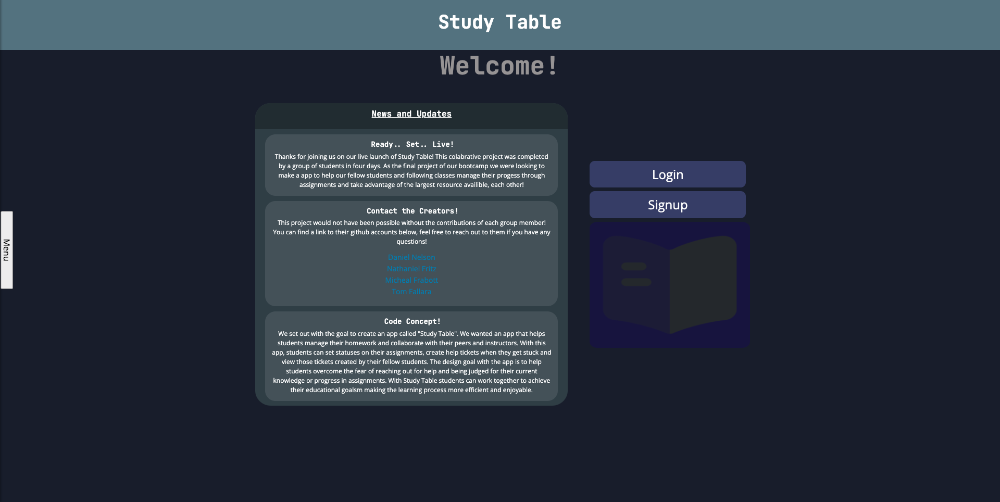

# Study Table

## Description
Study Table is an app that helps students manage their homework and collaborate with their peers and instructors. With this app, students can set statuses on their assignments, create help tickets when they get stuck and view those tickets created by their fellow students. The design goal with the app is to help students overcome the fear of reaching out for help and being judged for their current knowledge or progress in assignments. With Study Table students can work together to achieve their educational goalsm making the learning process more efficient and enjoyable.

## Table of Contents
* [Installation](#installation)
* [Usage](#usage)
* [License](#license)
* [Github](#github)
* [Deployment](#deployement-page)
* [Questions](#questions)

## Installation
To install app, run the following:

clone repo to terminal, install `nmp i`, then `npm run develop`. you'll then be able to access the app on your local server.
you can also go to 'https://secret-taiga-82685.herokuapp.com/' to see a working copy that is able to store and use data from a database

## Usage
When you come to the signup page, create either an instructor or student profile. 

As an instructor you can add a class, add students and assignments to each class. In addition you can see the status of the students progress if they are completed with an assignment or if they are still working on it.
As a student you can see the assignments that have been assigned to you and interact with other students in a comment board and be able to offer help or ask for help depending on where you are in the process of the assignment.

## License
MIT

## Github 
Repository where this app is stored
https://github.com/afredknot

## Deployement page
link to deployed page
https://secret-taiga-82685.herokuapp.com/

# Contributors
Study Table was developed and will have continued improvement by the following group

Michael Frabott - FullStack -- https://github.com/mfrabott

Tom Fallara - BackEnd -- https://github.com/TomFallara

Nathaniel Fritz - FrontEnd -- https://github.com/Dalidorn

Daniel Nelson - FullStack & DevOps -- https://github.com/afredknot